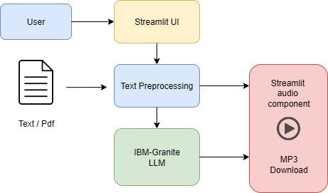
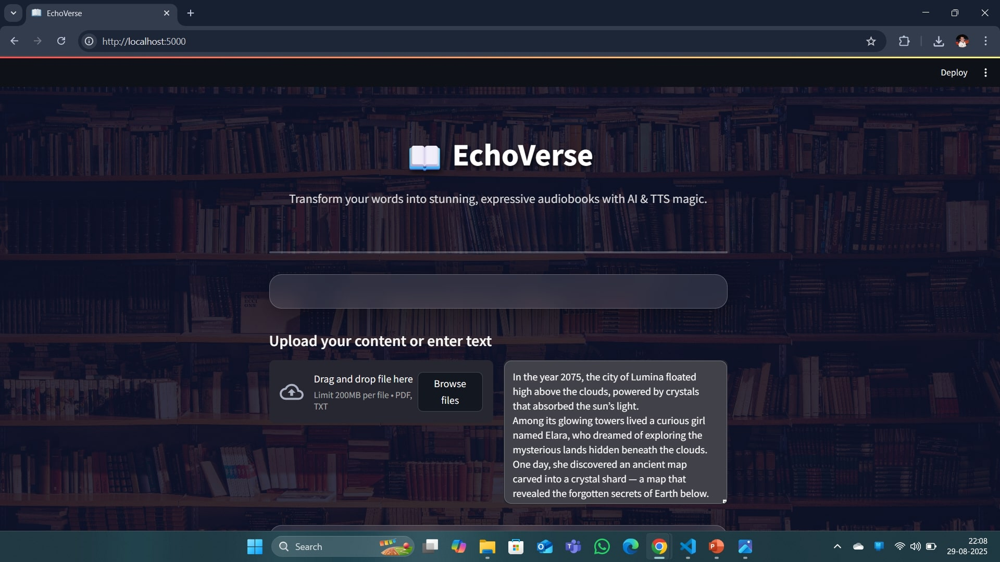
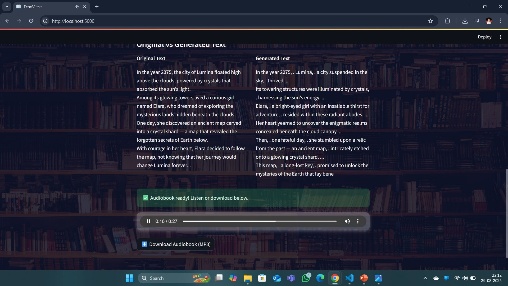

# 🎧 EchoVerse – AI-Powered Audiobook Generator  

EchoVerse is a **generative AI-based audiobook creation system** that transforms any text into expressive, downloadable audio.  
It’s designed to make content more **accessible, engaging, and reusable** for students, professionals, and visually impaired users.  

---

## 👥 Team TechForge  
- **[S. Pranav](https://github.com/deepuchary03)**  
- **[M. Praveen](https://github.com/praveenmaila)**  
- **[N. Anirudh](https://github.com/anirudh8980)**  

---

## 🚀 Features  
- **Tone-Adaptive Text Rewriting** – Rewrites input text into *Neutral, Suspenseful, or Inspiring* tones using IBM Watsonx Granite LLM while preserving meaning.  
- **High-Quality Voice Narration** – Converts rewritten text into natural-sounding audio using IBM Watson Text-to-Speech (Lisa, Michael, Allison).  
- **Downloadable & Streamable Output** – Listen directly in the app or download narration as `.mp3`.  
- **Side-by-Side Text Comparison** – Compare original text with tone-adapted version.  
- **User-Friendly Interface** – Built with Streamlit for quick interaction and accessibility.  

---

## 🛠️ Tech Stack  
- **Python** – Core development language  
- **IBM Watsonx Granite LLM** – For tone-adaptive text rewriting  
- **IBM Watson Text-to-Speech (TTS)** – For natural narration  
- **Streamlit** – Interactive user interface  
- **Hugging Face** – For extending NLP features (future-ready)  

---

## 🏗️ System Architecture  
  

**Flow:**  
1. User pastes text or uploads `.txt`  
2. Watsonx Granite LLM rewrites in selected tone  
3. Watson TTS converts rewritten text to audio  
4. Streamlit UI plays audio & enables `.mp3` download  

---

## 📸 Output Screens  
  
  

---

## 🔮 Future Scope  
- 🌍 Multilingual and regional voices  
- 🎭 More tones (Formal, Humorous, Motivational)  
- 📱 Mobile app / browser extension  
- 🎙️ Personalized voice cloning  
- 🎧 Direct export to podcast platforms (YouTube/Spotify)  
- ☁️ Cloud storage & collaboration features  

---

## ✅ Conclusion  
EchoVerse demonstrates how **AI + Speech Synthesis** can make text more expressive and accessible. With tone-aware rewriting, natural voices, and a user-friendly design, it creates an engaging audiobook experience for learners, creators, and visually impaired users.  

---

✨ *Built with passion at [CognitiveX Hackathon at TKR]*  

